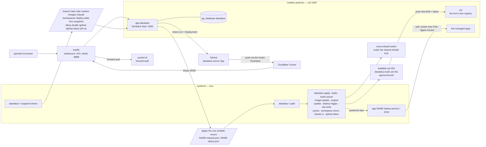
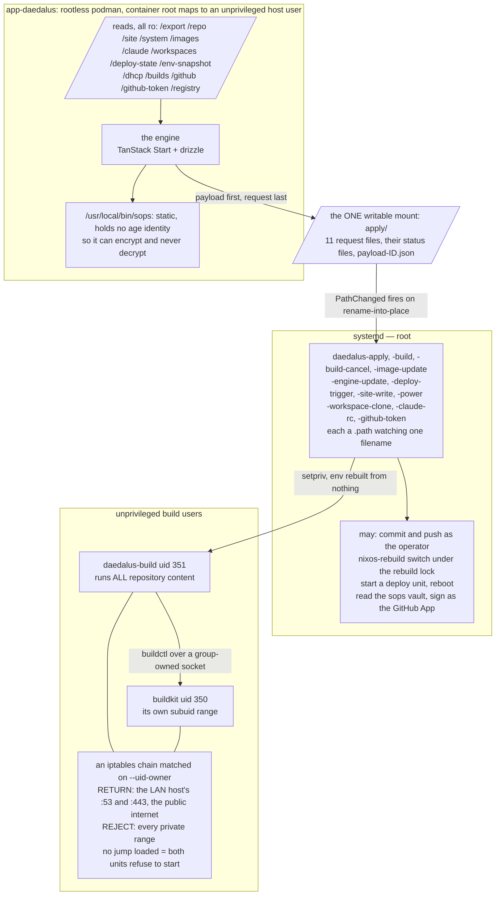
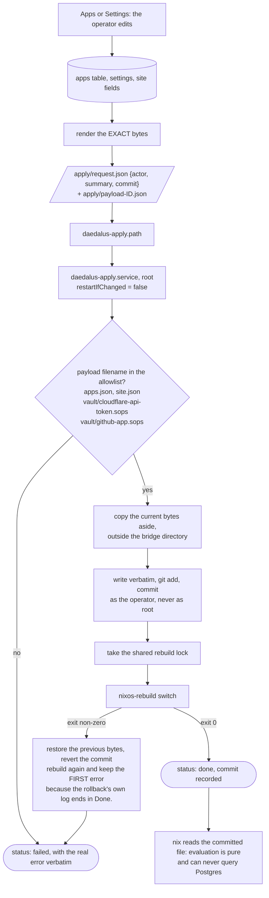
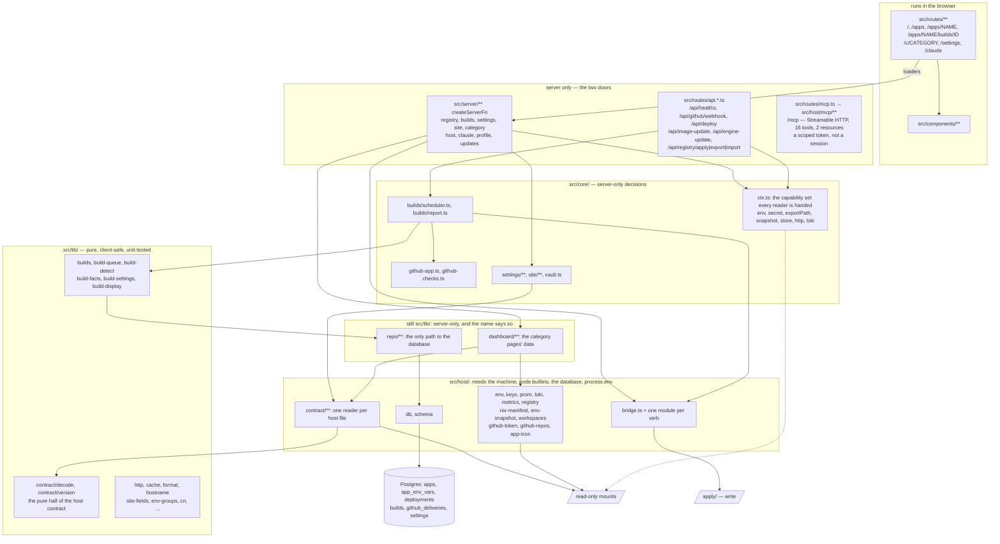
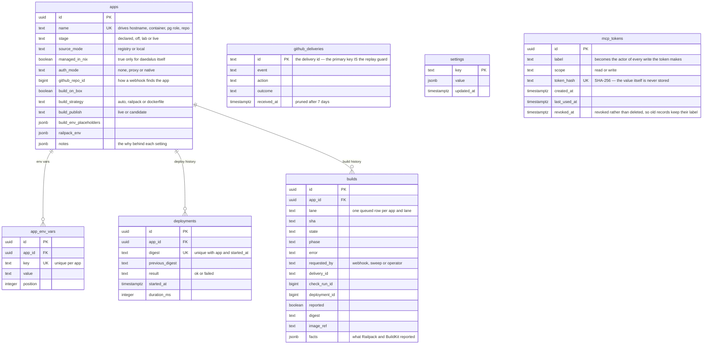

# How daedalus works

daedalus is a control plane for one machine. It runs *on* the machine it
manages, as an ordinary unprivileged container, and it has no privilege over
that machine at all — no docker socket, no sudo, no root, no ssh key. What it
has instead is one writable directory. It writes a JSON file into it; a systemd
path unit notices; a root oneshot reads the file and acts.

That constraint is the whole design. Everything below is a consequence of it:
the engine decides, the host executes, and the boundary between them is a
filename allowlist rather than an API. A compromised control plane can ask for
the eleven things the host knows how to do, and nothing else.

The machine is a NixOS box, so "act" mostly means: write a file into a git
repository, commit it, and run `nixos-rebuild switch`. The system's real source
of truth is that repository, not daedalus's database. daedalus is an editor for
it that happens to have a dashboard attached.

- **[BUILDS.md](BUILDS.md)** — how a `git push` becomes a running container.
- **[PLAN.md](PLAN.md)** — the dated record of how this was built, phase by phase.
- **[CONTRIBUTING.md](CONTRIBUTING.md)** — running it on your own machine.

---

## The box at a glance

Where a request enters, and what actually touches the machine.

Two things worth noticing. The engine never reaches out and *takes* host state:
timers push snapshots of it into read-only mounts, so a hung snapshot job makes
a page stale rather than making the engine hang. And the engine is a single
process holding a single `setInterval` — the scheduler that drives every build
on the box is one tick loop in one container, restartable at any moment.

---

## The bridge

This is the part to understand first, because every privileged thing daedalus
does goes through it.

**The protocol.** Each verb is one request filename and one status filename in
the same directory:

| request | agent unit | status |
|---|---|---|
| `request.json` | `daedalus-apply` | `status.json` + `last.log` + `payload-<id>.json` |
| `build-request.json` | `daedalus-build` | `build-status.json` |
| `build-cancel-request.json` | `daedalus-build-cancel` | — |
| `deploy-request.json` | `daedalus-deploy-trigger` | `deploy-status.json` |
| `image-request.json` | `daedalus-image-update` | `image-status.json` + `image-last.log` |
| `engine-request.json` | `daedalus-engine-update` | `engine-status.json` + `engine-last.log` |
| `site-request.json` | `daedalus-site-write` | `site-status.json` |
| `workspace-request.json` | `daedalus-workspace-clone` | `workspace-status.json` |
| `power-request.json` | `daedalus-power` | `power-status.json` |
| `claude-rc-request.json` | `daedalus-claude-rc` | `claude-rc-status.json` |
| `github-token-request.json` | `daedalus-github-token` | `github-token-status.json` |

Five rules make this safe, and each of them was learned the hard way:

1. **The request is written last.** Large inputs go into `payload-<id>.json`
   first; the small request that names it lands afterwards. A path unit that
   fires early therefore never sees a half-delivered job.
2. **Every write is a rename into place.** `PathChanged` fires on
   close-after-write *and* on rename, and only the rename is atomic, so a
   half-written request is never observable.
3. **The host reads as the unprivileged user, and refuses symlinks.** The
   request directory is writable by the container; without this, a planted
   symlink would make a root agent read or overwrite any file on the box.
4. **An answered id is never acted on twice.** Each agent compares the request's
   id against the id in its own status file. Path units re-fire on a daemon
   reload at boot, and the engine may rewrite a file it already dispatched;
   without this rule both would replay.
5. **The host decides what is real.** The engine's opinion about a build is a
   guess made from a status file; when the host later reports a terminal
   outcome for the same id, the host wins.

**What the container can and cannot reach.** It can *encrypt* a secret — it has
a sops binary with no age identity — and it can never read one back. It can ask
for a commit of four specific filenames and nothing else: the apply agent's
allowlist is `apps.json`, `site.json`, and the two vault files. It cannot run a
command, name a path, or choose a unit to restart.

---

## The two loops

Everything daedalus does is one of two shapes.

**Apply** turns an edit into a machine: database → rendered file → commit →
rebuild. It is how apps, settings, DNS, secrets and image pins all reach the
system.

**Build** turns a commit into a running container: webhook → queue → image →
registry → deploy. It is the subject of [BUILDS.md](BUILDS.md).

### The Apply loop

The agent is deliberately dumb. It does not generate, transform or validate the
registry; every decision about shape is TypeScript, where it is typed and
tested. What is left on the host is the part that genuinely needs the host: a
privileged rebuild, and git.

Two details that are easy to get wrong and expensive to relearn. A unit that
runs `nixos-rebuild switch` **must not be restarted by that switch** — an agent
whose own definition embeds a value it just changed will be SIGTERMed
mid-run, losing its verify and rollback phases and leaving a status stuck on
`running`. And the rollback must preserve the *first* error: rebuilding after a
revert succeeds, so a naive implementation reports `Done` for a failed Apply.

**Database versus repository.** The database is the editing surface; the
committed file is the contract. Nix evaluation is pure and can never query
Postgres, and the repository has to stay sufficient to rebuild the machine from
nothing. So daedalus's tables are a convenience: lose them and you lose history
and preferences, not the system.

---

## Inside the engine

The invariants the picture states: nothing in `client` imports a *value* from
`core` or from `host`, `lib/repo` is the only path to the database, and `core`
is imported dynamically so it never reaches a client bundle.

The `lib` / `host` line is the one a reader uses first, so it is drawn to be
answerable from the path alone: **a module lives in `src/host/` if it needs the
machine** — a `node:` builtin, the database, or `process.env` — or if it
statically imports something that does. `lib/repo/**` and `lib/dashboard/**`
are server-only as well and stay where they are, because *their* names already
carry the same information.

None of that holds by discipline. `src/host/boundary.test.ts` builds the real
import graph — static value imports only, since `import type` is erased by
`verbatimModuleSyntax` and a `createServerFn` handler is erased from the client
build — and fails if a component or a page route can reach a module that needs
the machine, or if such a module appears outside the server regions. A
component may still name a host module's *type*; deleting the `type` keyword
from that import is the mistake the test is there to catch.

`Ctx` is the seam that makes the server half testable — it is the set of
capabilities a reader is handed (environment, secrets, export paths, snapshots,
the settings store, HTTP, logs) rather than reaching for them directly.

---

## The MCP server

The third door, beside the pages and the `api.*` routes: `POST /mcp`, Streamable
HTTP, served by the app itself. It exists because before it the only way to
press "Build now" from outside a browser was to *drive* a browser — a
headless-Chromium script clicking a button — and a control plane an agent
cannot reach is a control plane an agent works around.

**It is an adapter, not a second implementation.** Every read tool calls the
loader the corresponding page calls; every write tool calls the same
`host/apply-flow.ts`, `host/update-flow.ts` or `core/builds/actions.ts` the
button calls. So an MCP call can do nothing the UI cannot, and an MCP answer
cannot disagree with the page that mirrors it. Sixteen tools:

| | |
|---|---|
| reads | `apps.list`, `apps.get`, `builds.list`, `builds.get`, `builds.log`, `deployments`, `images.freshness`, `dns.records`, `site.get`, `apply.preview`, `health` |
| writes | `build.now`, `build.cancel`, `deploy.trigger`, `image.update`, `apply` |

`apply.preview` is the diff an Apply would carry, computed by the very function
`runApply` computes it with, and committing nothing. Two resources —
`ARCHITECTURE.md` (this file) and `BUILDS.md` — are served so an agent can read
the design before acting.

**Authentication is a scoped token, and nothing else.** `/mcp` is in daedalus's
`authBypassRule`, so the request never sees Pocket ID: an agent cannot complete
a passkey redirect any more than zot can on `/api/deploy`. Instead the request
carries `Authorization: Bearer dmcp_…`, which is hashed and matched against a
stored SHA-256 digest in constant time **before any work** — no body parse, no
tool registration, no database read beyond the one indexed lookup. Fail-closed
in every direction: absent, unknown, malformed and revoked tokens all answer the
same 401, and with no token minted the endpoint refuses everything rather than
becoming open. The token value exists once, at mint, in Settings › Developer;
the database never holds it.

**Two scopes.** `read` reaches the eleven loaders; `write` reaches those plus
the five mutations. Every tool is registered for both, so a read token can still
*see* what a write token would reach and the refusal happens at the call rather
than hiding inside "unknown tool".

**Authorization is the token, deliberately and narrowly.** An MCP request has no
forward-auth headers at all, so `assertAdmin()` — which asks "is this session in
`admins`" — would refuse every tool call once the flag is armed. The answer is
not a bypass flag on the human gate but one named function beside it,
`core/authz.ts assertMachineActor`, which takes a proof of what the token said
and returns the actor to record. There are exactly as many machine-authorised
call sites as there are references to that symbol.

**What a write is recorded as** is the token's LABEL, namespaced: a build queued
through `/mcp` says `mcp:claude-code`, never "unknown operator". Naming the
holder at mint time is what makes that trail worth having.

**The ceremony survives.** `fleet.imageUpdates.<c>.ceremony` names what else an
update takes down, and the Updates panel arms its button only when the operator
types the container's name. `image.update` enforces the same predicate
(`lib/image-ceremony.ts`, shared with the panel) on a `confirm` argument — an
agent is precisely the caller that gate exists for.

**It is LAN-only, on purpose.** daedalus is `stage = "lab"`: no Cloudflare
tunnel route, no public name, and `isolated = true` means traefik is the only
thing that can dial the container. It is deliberately NOT registered in the
box's `fleet.mcpServers` gateway registry — fronting a write-capable control
plane with LiteLLM would hand it to Open WebUI, to every virtual key, and
potentially to an off-box model key, which is a wider blast radius than the
control plane's own UI has.

---

## The data model

Columns are trimmed to the load-bearing ones; the schema itself is the complete
answer.

Two of these carry load-bearing constraints rather than just data. A **partial
unique index** on `builds` allows exactly one `queued` row per app and lane —
that index, not application logic, is what makes "a newer push supersedes an
older queued build" correct under concurrency. And `github_deliveries`' primary
key *is* the replay guard: inserting the delivery id and enqueueing the build
happen in one transaction, so a redelivered webhook collides and is ignored.

---

## Trust boundaries

| Boundary | What crosses it | What holds |
|---|---|---|
| Internet → engine | GitHub webhooks only, over the tunnel, on one hostname and one path | HMAC over the raw body, verified before anything is believed; a body cap enforced while streaming; the delivery id inserted before any work |
| Operator → engine | Every page and action | Forward-auth in front of the whole host; the engine trusts a header it can only receive from the proxy |
| Agent → engine | The MCP tools at `/mcp`, on the LAN only | A scoped bearer token, matched against a stored SHA-256 digest in constant time before any work; fail-closed with none minted; write tools additionally pass `assertMachineActor` and are recorded under the token's label |
| Engine → host | Eleven filenames | The rules in [The bridge](#the-bridge) |
| Engine → GitHub | An installation token, minted by the host, never the private key | The key is root-only on the host and never enters the container; the token carries contents+metadata read, checks+deployments write |
| Host → repository code | A clone and a build | Repository content only ever runs as an unprivileged user inside an egress fence; the registry push credential exists for the duration of the one publishing call and is deleted after it |
| Build step → the box | Nothing by design | Rootless BuildKit in its own subuid range; a step that escapes lands as a user that owns nothing of the operator's |

The residual risks, stated rather than hidden: a build step that escapes its
sandbox lands as the BuildKit daemon's user, which can push images for any app;
a repository's own toolchain cache persists between its builds and could carry
files forward; the operator's browser session is as privileged as the operator;
and a leaked MCP write token is as privileged as the UI until it is revoked,
which is why it is LAN-only, labelled, stamped on every use, and revocable from
Settings in one click.

---

## Glossary

Most of this vocabulary is invented here, so it is worth stating plainly.

- **Apply** — the act of turning the database's current state into committed
  files and a rebuilt system. The bar at the top of the UI counts what is
  pending.
- **Bridge** — the request-file mechanism between the container and the host.
- **Verb** — one thing the host knows how to do on the engine's behalf; one
  request filename, one path unit, one script.
- **Snapshot** — a read-only copy of host state, refreshed by a timer into a
  mount the engine reads. Never a live query.
- **The site directory** — the git directory daedalus writes: `apps.json`,
  `site.json`, and the sops vault. The one directory the engine owns.
- **Drift** — the database and the committed file disagree; an Apply is owed.
- **Stage** — how much of an app exists, as four rungs: `declared` (the row,
  its database, data dir and secrets — no container, no ingress), `off` (the
  container runs, nothing can reach it), `lab` (LAN only), `live` (published
  through the tunnel). A new app is created `declared`, because the box only
  builds apps already in the committed registry and an entry whose image does
  not exist yet would fail the switch and revert its own Apply. The order is
  create → Apply → build → promote → Apply.
- **Publish mode** — what a build does with its image: `live` tags and deploys,
  `candidate` builds and publishes under a candidate tag and deploys nothing.
- **Lane** — which stream of commits a build belongs to. One queued build per
  app per lane.
- **Sweep** — the hourly pass that re-queues a commit whose webhook was lost.
- **The fence** — the firewall chain that confines the build users' egress.
- **Managed in nix** — an app declared by hand in the config rather than
  exported from the database. Exactly one app is: daedalus itself, because an
  Apply that broke its entry would take down the UI you would use to undo it.
