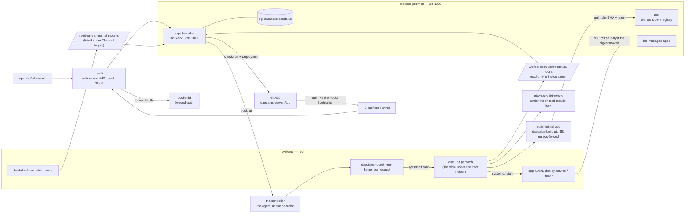
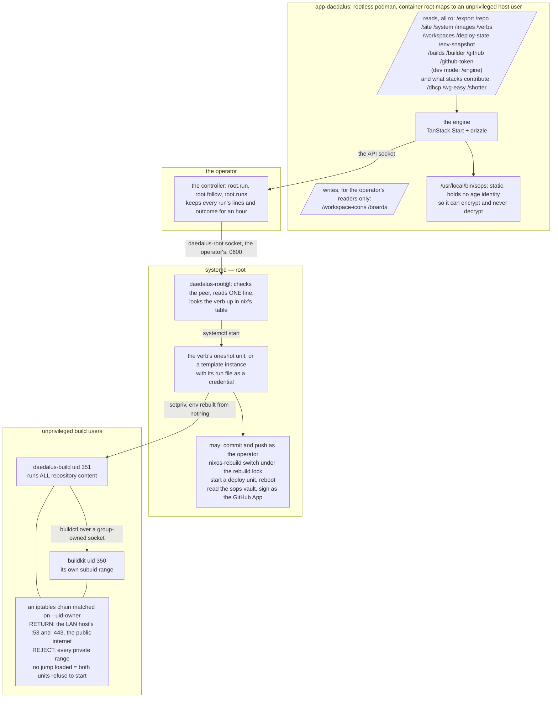
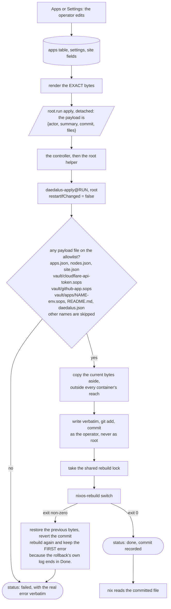
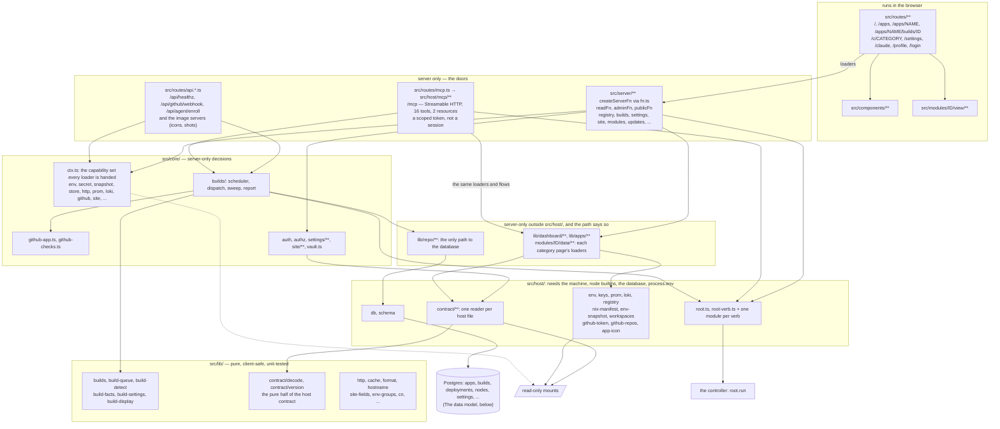
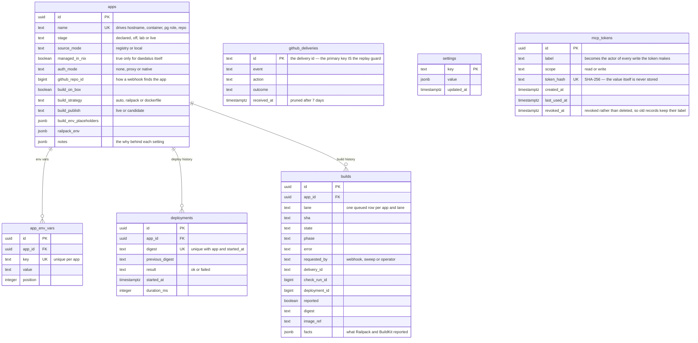

# How daedalus works

daedalus is a control plane for one machine. It runs *on* the machine it
manages, as an ordinary unprivileged container, and it has no privilege over
that machine at all — no docker socket, no sudo, no root, no ssh key. What it
has instead is one door: a socket to the controller, the agent on the box,
which runs as the operator and can ask a root helper to start one of a fixed
list of verbs. A verb is an existing systemd unit; what the app may say about
it is a value from a list nix wrote, or a payload the unit validates.

That constraint is the whole design. Everything below is a consequence of it:
the engine decides, the host executes, and the boundary between them is a
verb table nix renders rather than an API. A compromised control plane can
ask for the few things the host knows how to do, and nothing else.

The machine is a NixOS box, so "act" mostly means: write a file into a git
repository, commit it, and run `nixos-rebuild switch`. The system's real source
of truth is that repository, not daedalus's database. daedalus is an editor for
it that happens to have a dashboard attached.

- **[BUILDS.md](BUILDS.md)** — how a `git push` becomes a running container.
- **[CONTRIBUTING.md](CONTRIBUTING.md)** — running it on your own machine.
- **[nix/README.md](nix/README.md)** — the NixOS side: how a host imports the engine.
- **[PLAN.md](PLAN.md)** — what is still missing; what landed is in git history.

---

## The box at a glance

Where a request enters, and what actually touches the machine.

```mermaid
flowchart LR
  Browser["operator's browser"]
  GH["GitHub<br/>daedalus-server App"]
  CF["Cloudflare Tunnel"]
  Traefik["traefik<br/>websecure :443, cfweb :8888"]
  PID["pocket-id<br/>forward-auth"]

  subgraph pod["rootless podman — uid 1000"]
    App["app-daedalus<br/>TanStack Start :3000"]
    PG[("pg, database daedalus")]
    Zot["zot<br/>the box's own registry"]
    Apps["the managed apps"]
  end

  Ctl["the controller<br/>the agent, as the operator"]
  Verbs[/"/verbs: each verb's status, root's<br/>read-only in the container"/]
  Snaps[/"read-only snapshot mounts<br/>(listed under The root helper)"/]

  subgraph root["systemd — root"]
    Helper["daedalus-root@: one helper per request"]
    Units["one unit per verb<br/>(the table under The root helper)"]
    SnapJobs["daedalus-*-snapshot timers"]
    DeployU["app-NAME-deploy.service / .timer"]
  end

  Nix["nixos-rebuild switch<br/>under the shared rebuild lock"]
  BK["buildkitd uid 350<br/>daedalus-build uid 351<br/>egress-fenced"]

  Browser --> Traefik
  GH -- "push via the hooks hostname" --> CF --> Traefik
  Traefik -- "forward-auth" --> PID
  Traefik --> App
  App --- PG
  App -- "root.run" --> Ctl --> Helper -- "systemctl start" --> Units
  Units --> Verbs --> App
  Units --> Nix
  Units --> BK -- "push sha-SHA + latest" --> Zot
  Units -- "systemctl start" --> DeployU
  DeployU -- "pull, restart only if the digest moved" --> Apps
  SnapJobs --> Snaps --> App
  App -- "check run + Deployment" --> GH
```

Two things worth noticing. The engine never reaches out and *takes* host state:
timers push snapshots of it into read-only mounts, so a hung snapshot job makes
a page stale rather than making the engine hang. And the scheduler that drives
every build on the box is one `setInterval` tick loop in one process,
restartable at any moment.

---

## The root helper

This is the part to understand first, because every privileged thing daedalus
does goes through it.

```mermaid
flowchart TB
  subgraph unpriv["app-daedalus: rootless podman, container root maps to an unprivileged host user"]
    Engine["the engine<br/>TanStack Start + drizzle"]
    Rd[/"reads, all ro: /export /repo /site /system /images /verbs<br/>/workspaces /deploy-state /env-snapshot<br/>/builds /builder /github /github-token<br/>(dev mode: /engine)<br/>and what stacks contribute: /dhcp /wg-easy /shotter"/]
    Wr[/"writes, for the operator's readers only:<br/>/workspace-icons /boards"/]
    Sops["/usr/local/bin/sops: static, holds no age identity<br/>so it can encrypt and never decrypt"]
  end

  subgraph op["the operator"]
    Ctl["the controller: root.run, root.follow, root.runs<br/>keeps every run's lines and outcome for an hour"]
  end

  subgraph priv["systemd — root"]
    H["daedalus-root@: checks the peer, reads ONE line,<br/>looks the verb up in nix's table"]
    U["the verb's oneshot unit, or a template instance<br/>with its run file as a credential"]
    Caps["may: commit and push as the operator<br/>nixos-rebuild switch under the rebuild lock<br/>start a deploy unit, reboot<br/>read the sops vault, sign as the GitHub App"]
  end

  subgraph fenced["unprivileged build users"]
    BU["daedalus-build uid 351<br/>runs ALL repository content"]
    BKU["buildkit uid 350<br/>its own subuid range"]
    Fence["an iptables chain matched on --uid-owner<br/>RETURN: the LAN host's :53 and :443, the public internet<br/>REJECT: every private range<br/>no jump loaded = both units refuse to start"]
  end

  Rd --> Engine
  Engine --> Sops
  Engine -- "the API socket" --> Ctl
  Ctl -- "daedalus-root.socket, the operator's, 0600" --> H
  H -- "systemctl start" --> U --> Caps
  U -- "setpriv, env rebuilt from nothing" --> BU
  BU -- "buildctl over a group-owned socket" --> BKU
  BU --- Fence
  BKU --- Fence
```

**The path.** The app asks the controller — the agent on the box, running as
the operator — for `root.run {verb, selectors, payload?, detach?}` over its API
socket; the app never reaches anything else of the host's. The controller
connects to `daedalus-root.socket`, a systemd socket the operator owns (0600,
`Accept=yes`, outside every container's mounts); systemd starts a fresh root
process for that one connection, `daedalus-agent root-helper`, with no
capabilities and a strict sandbox. The helper checks the peer's uid is the
operator's (`SO_PEERCRED`), reads one line, looks the verb up in a table nix
rendered from `fleet.daedalus.rootVerbs`, and runs `systemctl start` on the
verb's existing oneshot unit — each selector a value from a fixed list,
spliced into the unit name, never a path or a flag.

**Values no list can hold.** A repository slug or a variable name is a
*pattern* selector: an anchored regex nix declares and the helper checks
again, over a small character set with a length cap. A request body — a
sealed secret, the build request, an Apply's rendered files — is a *payload*,
capped per verb. Neither goes into a unit name or onto a command line: such a
verb names a template, `x@.service`, and the helper writes the selectors and
the payload to `/run/daedalus-root-runs/<run id>.json` (root's, 0600, created
exclusively without following a link) and starts `x@<run id>`, which gets the
file as a systemd credential and validates every field as if it were hostile —
it was the container's to choose. The file goes when the unit stops.

**The answer.** The unit's journal lines stream back as `root.progress`
events, and the journal carries the outcome too: a start job that failed is
`failed`; otherwise what the unit's one outcome entry says (`host/lib.sh`
`verb_done` / `refuse`: `DAEDALUS_OUTCOME` `done` or `refused`, taken only
when journald's own fields say the unit's run wrote it as root or the
operator, never by a line's text), or `done` with its last line
when it wrote none. A refusal exits 0 — it is not a failed unit — and the
journal, not an exit status, carries the word, because systemd forgets a
oneshot's exit status once it is inactive. The controller keeps every run's
lines and outcome for an hour (`root.follow`, `root.runs`), so a page opened
mid-run reattaches. A long verb is asked with `detach`: the answer comes once
its unit has started, and no request is held for the run.

**What holds.**

1. **Nothing is replayed.** Nothing but a connection starts a verb: no path
   unit re-fires at boot, no file sits waiting to be read twice.
2. **One run of a verb at a time.** A unit already running is refused, never
   joined; every verb holds a lock in the run directory (its unit's, or its
   template's) from before its busy check until its answer, so two requests
   cannot both start it.
3. **The work outlives its caller.** It is the unit's: a switch that restarts
   the controller, the helper or the app leaves it running, and a unit that
   rebuilds the system is never restarted by that rebuild
   (`restartIfChanged = false`).
4. **Root reads nothing the container wrote.** The request is a run file only
   root can write; the status a verb reports goes into `/verbs`, a directory
   only root can write and the container mounts read-only. The two directories
   the container does write (`/workspace-icons`, `/boards`) have readers that
   run as the operator, never root.
5. **The host decides what is real.** A verb's status is the unit's word; a
   `running` status whose run the controller says has ended (or whose unit
   systemd says is not running) is reported as failed, never guessed from a
   clock.

**What the container can and cannot reach.** It can *encrypt* a secret — it has
a sops binary with no age identity — and it can never read one back. It can ask
for a commit of a fixed set of filenames and nothing else: the Apply's
allowlist is `apps.json`, `nodes.json`, `site.json`, the two vault files, one
`vault/apps/<name>-env.sops` per app already in the committed registry (the
list is built host-side, never read from the request), `README.md` and the
`daedalus.json` provenance stamp. It cannot run a command, name a path, or
choose a unit to start.

**The verbs** — THE list; `fleet.daedalus.rootVerbs` is its source, and
`status` reads it back with each unit's state.

| verb | unit | what it does |
|---|---|---|
| `status` | the helper's own read | every verb and its unit's state (a template's: whether an instance runs) |
| `reboot` | `daedalus-power` | restart the box; refuses mid-rebuild; there is no poweroff |
| `deploy {app}` | `app-<app>-deploy` | the app's own deploy now; a run the timer started is refused, not joined |
| `task-run {task}` | `app-<app>-task-<id>` | an app's scheduled task now; the value is `<app>-task-<id>`, one token per unit |
| `github-token` | `daedalus-github-token` | mint the installation token now; refuses inside its one-mint-a-minute throttle |
| `session-host-restart` | `daedalus-session-host-restart` | restart the session host: how a new build takes over, ending every live terminal |
| `build-cancel {app}` | `daedalus-build-cancel@<app>` | stop the build in flight, only when it is that app's |
| `workspace-clone {repo, actor}` | `daedalus-workspace-clone@<run>` | clone, or fast-forward an existing clone, over the operator's SSH identity |
| `secret-set {app, action, key, actor}` + payload | `daedalus-secret-set@<run>` | merge or drop one key in `vault/apps/<app>-env.sops` and commit; the payload is the value sealed by the container |
| `nodes-dhcp` + payload | `daedalus-nodes-dhcp@<run>` | the approved nodes' `dhcp-host` lines: kept in `/verbs`, handed to pi-hole, FTL reloaded (daedalus-nodes.nix) |
| `build` + payload, detached | `daedalus-build@<run>` | build an app's image and start its deploy; status `/verbs/build-status.json`, followed by the scheduler (BUILDS.md) |
| `apply` + payload, detached | `daedalus-apply@<run>` | write the managed files, commit, build, switch (or `test` under an engine override), roll back keeping the first error; the Apply loop, below |
| `image-update` + payload, detached | `daedalus-image-update@<run>` | move image pins: one commit, one rebuild, verify, revert on failure |
| `version-update` + payload, detached | `daedalus-version-update@<run>` | move a stack's version strings, snapshot its dataset, switch, verify, roll both back on failure |
| `engine-update` + payload, detached | `daedalus-engine-update@<run>` | fast-forward the engine clone, move the lock onto it, build, switch, verify the control plane answers, revert if not, push |
| `claude-code-update` + payload, detached | `daedalus-engine-update@<run>` | pin upstream's latest Claude Code in the engine and push, then the engine update in the same run: one unit, so one lock and one busy check cover both verbs |

Every detached verb reports in `/verbs/<verb>-status.json` under its run's id,
which the page that started it waits for.

---

## The two loops

Everything daedalus does is one of two shapes.

**Apply** turns an edit into a machine: database → rendered file → commit →
rebuild. It is how apps, settings, DNS, secrets and image pins all reach the
system.

**Build** turns a commit into a running container: webhook → queue → image →
registry → deploy. It is the subject of [BUILDS.md](BUILDS.md).

### The Apply loop

```mermaid
flowchart TB
  UI["Apps or Settings: the operator edits"]
  DBT[("apps table, settings, site fields")]
  Render["render the EXACT bytes"]
  Req[/"root.run apply, detached: the payload is<br/>{actor, summary, commit, files}"/]
  PathU["the controller, then the root helper"]
  Sh["daedalus-apply@RUN, root<br/>restartIfChanged = false"]
  Allow{"any payload file on the allowlist?<br/>apps.json, nodes.json, site.json<br/>vault/cloudflare-api-token.sops<br/>vault/github-app.sops<br/>vault/apps/NAME-env.sops, README.md, daedalus.json<br/>other names are skipped"}
  Prev["copy the current bytes aside,<br/>outside every container's reach"]
  Git["write verbatim, git add, commit<br/>as the operator, never as root"]
  Lock["take the shared rebuild lock"]
  Sw["nixos-rebuild switch"]
  Ok(["status: done, commit recorded"])
  Roll["restore the previous bytes, revert the commit<br/>rebuild again and keep the FIRST error<br/>because the rollback's own log ends in Done."]
  Bad(["status: failed, with the real error verbatim"])
  NixRead["nix reads the committed file"]

  UI --> DBT --> Render --> Req --> PathU --> Sh --> Allow
  Allow -- no --> Bad
  Allow -- yes --> Prev --> Git --> Lock --> Sw
  Sw -- "exit 0" --> Ok
  Sw -- "exit non-zero" --> Roll --> Bad
  Ok --> NixRead
```

The agent is deliberately dumb. It does not generate, transform or validate the
registry; every decision about shape is TypeScript, where it is typed and
tested. What is left on the host is the part that genuinely needs the host: a
privileged rebuild, and git.

Two details that are easy to get wrong and expensive to relearn. A unit that
runs `nixos-rebuild switch` **must not be restarted by that switch** — an agent
whose own definition embeds a value it just changed will be SIGTERMed
mid-run, losing its verify and rollback phases and leaving a status stuck on
`running`. And the rollback must preserve the *first* error: rebuilding after a
revert succeeds, so a naive implementation reports `Done` for a failed Apply.

One switch changes the last step: while site.json names an engine override
(Settings › Developer), every Apply builds against that local engine clone and
activates with `nixos-rebuild test`, never `switch` — the lock is left alone and
a reboot undoes it.

**Database versus repository.** The database is the editing surface; the
committed file is the contract. Nix evaluation is pure and can never query
Postgres, and the repository has to stay sufficient to rebuild the machine from
nothing. So daedalus's tables are a convenience: lose them and you lose history
and preferences, not the system.

---

## Inside the engine

```mermaid
flowchart TB
  subgraph client["runs in the browser"]
    Routes["src/routes/**<br/>/, /apps, /apps/NAME, /apps/NAME/builds/ID<br/>/c/CATEGORY, /settings, /claude, /profile, /login"]
    Comps["src/components/**"]
    Views["src/modules/ID/view/**"]
  end

  subgraph edge["server only — the doors"]
    Srv["src/server/**  createServerFn via fn.ts<br/>readFn, adminFn, publicFn<br/>registry, builds, settings, site, modules, updates, ..."]
    Api["src/routes/api.*.ts<br/>/api/healthz, /api/github/webhook, /api/agent/enroll<br/>and the image servers (icons, shots)"]
    Mcp["src/routes/mcp.ts → src/host/mcp/**<br/>/mcp — Streamable HTTP, 16 tools, 2 resources<br/>a scoped token, not a session"]
  end

  subgraph core["src/core/ — server-only decisions"]
    Ctx["ctx.ts: the capability set every loader is handed<br/>env, secret, snapshot, store, http, prom, loki, github, site, ..."]
    Bld["builds/: scheduler, dispatch, sweep, report"]
    Ghc["github-app.ts, github-checks.ts"]
    Set["auth, authz, settings/**, site/**, vault.ts"]
  end

  subgraph lib["src/lib/ — pure, client-safe, unit-tested"]
    BuildLib["builds, build-queue, build-detect<br/>build-facts, build-settings, build-display"]
    Decode["contract/decode, contract/version<br/>the pure half of the host contract"]
    Shared["http, cache, format, hostname<br/>site-fields, env-groups, cn, ..."]
  end

  subgraph named["server-only outside src/host/, and the path says so"]
    Repo["lib/repo/**: the only path to the database"]
    Dash["lib/dashboard/**, lib/apps/**<br/>modules/ID/data/**: each category page's loaders"]
  end

  subgraph host["src/host/: needs the machine, node builtins, the database, process.env"]
    Verbs["root.ts, root-verb.ts + one module per verb"]
    Contract["contract/**: one reader per host file"]
    Dbm["db, schema"]
    Clients["env, keys, prom, loki, registry<br/>nix-manifest, env-snapshot, workspaces<br/>github-token, github-repos, app-icon"]
  end

  DB[("Postgres: apps, builds, deployments, nodes, settings, ...<br/>(The data model, below)")]
  Snap[/"read-only mounts"/]
  Ctl["the controller: root.run"]

  Routes --> Comps
  Routes --> Views
  Routes -- "loaders" --> Srv
  Srv --> Ctx
  Api --> Ctx
  Srv --> Verbs
  Srv --> Set
  Srv --> Dash
  Api --> Bld
  Mcp -- "the same loaders and flows" --> Dash
  Mcp --> Verbs
  Mcp --> Bld
  Bld --> BuildLib
  Bld --> Ghc
  Bld --> Verbs
  Bld --> Repo
  Set --> Contract
  Dash --> Contract
  Dash --> Clients
  Repo --> Dbm --> DB
  Contract --> Decode
  Contract --> Snap
  Clients --> Snap
  Verbs --> Ctl
  Ctx -.-> Snap
```

The invariants the picture states: nothing in `client` imports a *value* from
`host`, or from `core` beyond its two pure files (`auth-names.ts`,
`settings/types.ts`); `lib/repo` is the only path to the database; and the
server functions import `core` dynamically so it never reaches a client bundle.

The `lib` / `host` line is the one a reader uses first, so it is drawn to be
answerable from the path alone: **a module lives in `src/host/` if it needs the
machine** — a `node:` builtin, the database, or `process.env` — or if it
statically imports something that does. `lib/repo/**`, `lib/dashboard/**`,
`lib/apps/**` and each module's `data/**` are server-only as well and stay
where they are, because *their* paths already carry the same information.

None of that holds by discipline. `src/host/boundary.test.ts` builds the real
import graph — static value imports only, since `import type` is erased by
`verbatimModuleSyntax` and a `createServerFn` handler is erased from the client
build — and fails if a component or a page route can reach a module that needs
the machine, or if such a module appears outside the server regions. A
component may still name a host module's *type*; deleting the `type` keyword
from that import is the mistake the test is there to catch.

`Ctx` is the seam that makes the server half testable — a loader is handed its
capabilities (environment, secrets, snapshots, the settings store, HTTP,
metrics, logs, GitHub, the box's identity) rather than reaching for them
directly.

---

## The MCP server

The third door, beside the pages and the `api.*` routes: `POST /mcp`, Streamable
HTTP, served by the app itself, so an agent acts through the control plane
rather than around it.

**It is an adapter, not a second implementation.** Every read tool calls the
loader the corresponding page calls; every write tool calls the same
`host/apply-flow.ts`, `host/update-flow.ts`, `core/builds/actions.ts` or
`lib/apps/deploy.ts` the
button calls. So an MCP call can do nothing the UI cannot, and an MCP answer
cannot disagree with the page that mirrors it. Sixteen tools:

| | |
|---|---|
| reads | `apps.list`, `apps.get`, `builds.list`, `builds.get`, `builds.log`, `deployments`, `images.freshness`, `dns.records`, `site.get`, `apply.preview`, `health` |
| writes | `build.now`, `build.cancel`, `deploy.trigger`, `image.update`, `apply` |

`apply.preview` is the diff an Apply would carry, computed by the very function
`runApply` computes it with, and committing nothing. Two resources —
`ARCHITECTURE.md` (this file) and `BUILDS.md` — are served so an agent can read
the design before acting.

**Authentication is a scoped token, and nothing else.** `/mcp` is in daedalus's
`authBypassRule`, so the request never sees Pocket ID: an agent cannot complete
a passkey redirect. Instead the request
carries `Authorization: Bearer dmcp_…`, which is hashed and matched against a
stored SHA-256 digest in constant time **before any work** — no body parse, no
tool registration, no database read beyond the one indexed lookup. Fail-closed
in every direction: absent, unknown, malformed and revoked tokens all answer the
same 401, and with no token minted the endpoint refuses everything rather than
becoming open. The token value exists once, at mint, in Settings › Developer;
the database never holds it.

**Two scopes.** `read` reaches the eleven loaders; `write` reaches those plus
the five mutations. Every tool is registered for both, so a read token can still
*see* what a write token would reach and the refusal happens at the call rather
than hiding inside "unknown tool".

**Authorization is the token, deliberately and narrowly.** An MCP request has no
forward-auth headers at all, so `assertAdmin()` — which asks "is this session in
`admins`" — would refuse every tool call. The answer is
not a bypass flag on the human gate but one named function beside it,
`core/authz.ts assertMachineActor`, which takes a proof of what the token said
and returns the actor to record. There are exactly as many machine-authorised
call sites as there are references to that symbol.

**What a write is recorded as** is the token's LABEL, namespaced: a build queued
through `/mcp` says `mcp:claude-code`, never "unknown operator". Naming the
holder at mint time is what makes that trail worth having.

**The ceremony survives.** `fleet.imageUpdates.<c>.ceremony` names what else an
update takes down (`majorCeremony`: what a move to a new major takes), and the
Updates panel arms its button only when the operator types the pin's name.
`image.update` enforces the same predicate
(`lib/image-ceremony.ts`, shared with the panel) on a `confirm` argument — an
agent is precisely the caller that gate exists for.

**It is LAN-only, on purpose.** daedalus is `stage = "lab"`: no Cloudflare
tunnel route, no public name, and the token is checked before any work
whoever dials the container. It is deliberately NOT registered in the
box's `fleet.mcpServers` gateway registry — fronting a write-capable control
plane with LiteLLM would hand it to Open WebUI, to every virtual key, and
potentially to an off-box model key, which is a wider blast radius than the
control plane's own UI has.

---

## The other machines

One Rust agent (`agent/`) runs on every machine. On the box it is the
controller (`daedalus-controller.service`, as the operator): the app's one
socket to the host — `root.run`, above — and the end every other
machine's agent links to: one outbound TLS 1.3 connection per machine,
each side pinning the other's ed25519 key (the trust boundaries below). A
machine reports its status document and telemetry up that link; the app
hands the controller the desired set — every approved or revoked key, with
its policy — and reads the machines through `nodes.*` calls. It never dials
a machine. A provider a machine offers (a Lemonade model server) is read by
that machine's agent and reported the same way, and installed, updated,
started and stopped by it on the controller's verbs (`nodes.provider_install`,
`nodes.provider_power`); the app keeps LiteLLM's routes in step with it
through LiteLLM's own API, and an unread catalog keeps them as they are.

The app↔controller contract is defined once, in Rust: `agent/gate.sh gen`
generates the TypeScript types, the `Methods` map, the constants and golden
fixtures into `app/src/host/controller/generated/`, and the app's decoders
are held to those types both ways (its tests decode every fixture). A
controller running another agent release than the engine builds is said
above every page. [agent/README.md](agent/README.md) is the agent's own
mechanics; [session-host/README.md](session-host/README.md) is santree's
remote projects, which ride the same keys.

---

## The data model

Tables and columns are trimmed to the load-bearing ones; the schema
(`app/src/host/schema.ts`) is the complete answer. Not drawn: `app_tasks` (an
app's scheduled commands), `local_admins` (the break-glass password login,
dormant unless site.json turns it on) and `nodes` (the machines an admin approved
or revoked, keyed by the agent's public key; the controller holds the rest).

```mermaid
erDiagram
  apps ||--o{ app_env_vars : "env vars"
  apps ||--o{ deployments : "deploy history"
  apps ||--o{ builds : "build history"

  apps {
    uuid id PK
    text name UK "drives hostname, container, pg role, repo"
    text stage "declared, off, lab or live"
    text source_mode "registry or local"
    boolean managed_in_nix "true only for daedalus itself"
    text auth_mode "none, proxy or native"
    bigint github_repo_id "how a webhook finds the app"
    boolean build_on_box
    text build_strategy "auto, railpack or dockerfile"
    text build_publish "live or candidate"
    jsonb build_env_placeholders
    jsonb railpack_env
    jsonb notes "the why behind each setting"
  }

  app_env_vars {
    uuid id PK
    uuid app_id FK
    text key UK "unique per app"
    text value
    integer position
  }

  deployments {
    uuid id PK
    uuid app_id FK
    text digest UK "unique with app and started_at"
    text previous_digest
    text result "ok or failed"
    timestamptz started_at
    integer duration_ms
  }

  builds {
    uuid id PK
    uuid app_id FK
    text lane "one queued row per app and lane"
    text sha
    text state
    text phase
    text error
    text requested_by "webhook, sweep or operator"
    text delivery_id
    bigint check_run_id
    bigint deployment_id
    boolean reported
    text digest
    text image_ref
    jsonb facts "what Railpack and BuildKit reported"
  }

  github_deliveries {
    text id PK "the delivery id — the primary key IS the replay guard"
    text event
    text action
    text outcome
    timestamptz received_at "pruned after 7 days"
  }

  settings {
    text key PK
    jsonb value
    timestamptz updated_at
  }

  mcp_tokens {
    uuid id PK
    text label "becomes the actor of every write the token makes"
    text scope "read or write"
    text token_hash UK "SHA-256 — the value itself is never stored"
    timestamptz created_at
    timestamptz last_used_at
    timestamptz revoked_at "revoked rather than deleted, so old records keep their label"
  }
```

Two of these carry load-bearing constraints rather than just data. A **partial
unique index** on `builds` allows exactly one `queued` row per app and lane —
that index, not application logic, is what makes "a newer push supersedes an
older queued build" correct under concurrency. And `github_deliveries`' primary
key *is* the replay guard: inserting the delivery id and enqueueing the build
happen in one transaction, so a redelivered webhook collides and is ignored.

Every text column with a fixed vocabulary — a stage, a mode, a build state, a
scope — carries a CHECK built from the tuple in `lib/` that the decoders and
validators read too, so a value no reader understands cannot be stored. And the
tables are bounded by the scheduler's hourly sweep (`core/builds/sweep.ts`):
deliveries go after 7 days, a finished build's detection, checks, timings,
warnings and facts after 30 (the row stays), deploys after a year, and enroll
codes once expired.

---

## Trust boundaries

| Boundary | What crosses it | What holds |
|---|---|---|
| Internet → engine | GitHub webhooks only, over the tunnel, on one hostname and one path | HMAC over the raw body, verified before anything is believed; a body cap enforced while streaming; the delivery id inserted before any work |
| Operator → engine | Every page and action | Forward-auth in front of the whole host, bar the self-authenticating paths in the rows below and the app's icons; the app answers nothing without traefik's proxy proof (`X-Proxy-Proof`, a per-app secret it compares in constant time — the container shares bridges, so being dialled proves nothing): one request gate refuses everything else bar those same self-authenticating paths and a GET carrying the reader token, a machine-minted secret the headless browser holds, which reads with no identity; the engine trusts the identity headers only beside that proof, or a break-glass local login, dormant unless site.json turns it on; mutations are `adminFn`, which requires the `admins` group |
| Agent → engine | The MCP tools at `/mcp`, on the LAN only | A scoped bearer token, matched against a stored SHA-256 digest in constant time before any work; fail-closed with none minted; write tools additionally pass `assertMachineActor` and are recorded under the token's label |
| Machine → controller → engine | Each machine's one link to the controller — the agent on the box, TCP 7788 on the LAN — and the controller's unix socket in the app's container | TLS 1.3 with each side pinning the other's ed25519 key (the machine's pin from its install line or a later `pair`, which only an administrator can run — a Mac's from its log-in, whose last step runs as root behind the administrator prompt — the tray runs it elevated behind the OS's own prompt, and the agent's local socket has no pairing method, so a local non-admin cannot hand a machine's service to a controller of their own; nothing is trusted on first use, and a machine without a pin stays unpaired and dials nobody); an unknown key waits `pending` at the controller with nothing pushed to it until an admin approves it, which creates its `nodes` row and hands the controller the whole desired set. An approved machine may ask for its own keep-awake, Claude Remote Control and santree OFF (`policy_request`: absolute values, at most ten a minute) — never santree on, which the controller refuses and the app refuses again; santree on is an admin's, on Settings › Machines, through a consent dialog that shows the machine and its full key, the app re-checking the key shown, the row's approval and the session host. The app writes only the keys asked for and sends the set again: the machine changes nothing itself. The socket serves only the uids the controller lists, and takes fixed verbs with a node id |
| Machine → session host | santree's protocol v1 — terminals, argv exec, file writes — from santree on a machine through the agent's local santree socket, piped by the agent over its own TLS connection to the box's session host, TCP 7789 on the LAN and the system VPN | **santree.sock: the installing user's processes (any of them) → node key → root on the box**: an admitted node key is a login as the operator, who has NOPASSWD sudo. The socket serves root and the user who installed the agent (recorded from `sudo` at install), never whoever holds the console; the agent pins the host's key, which the controller hands it from the host's status file. TLS 1.3 with each side pinning the other's ed25519 key; the host admits only the keys in the allow-list file the controller writes in its own directory (approved nodes whose policy turns santree on; missing or untrustworthy = nobody), re-read every second, and a node that leaves it loses its connections and the PTYs it opened. Revocation rides the controller: a revoke or santree turned off while the controller is down, or while it refuses the app's set, reaches the host with the next set it takes. Confining working directories and writes to the projects root catches client bugs; it is not a boundary |
| Machine → engine (a Mac's log-in) | `POST /api/agent/enroll`, the one path of the app a machine's service calls, outside forward-auth, on the LAN | A single-use code with a short life, minted by an admin's Confirm on the gated enroll page (a consent page showing the machine and its full key, its one-time form token bound to that admin and that key), bound to the PKCE challenge the agent sent there and redeemed only with its verifier (S256), which never leaves the agent's service. The answer — the machine's wg-easy client config, the controller's pin and in-tunnel address — goes to that service alone; the loopback callback in between carries only the code |
| Machine's tunnel → box | A Mac's own WireGuard client of the box's wg-easy (UDP 51820, the forwarded port), ended inside the agent's service (boringtun + smoltcp, no utun): AllowedIPs the box's LAN address alone, and the agent dials only the link's and the session host's ports through it | WireGuard's keys; the client's private key reaches the machine once, in the redeem answer, and is kept 0600 by root. **A stolen tunnel key is a LAN presence at the box's address**, so the client carries a per-client firewall (wg-easy's, on with `firewallEnabled`) of those two ports alone; what the netns itself serves (traefik's 80/443, the wg-easy UI) stays reachable, as for every peer. Past the tunnel the node key still gates the controller and the session host. Revoke and log-out delete the client |
| A Mac's user → its root service | Daedalus Agent.app, which launchd runs as root from `/Library/Application Support/daedalus-agent/` — a folder chain only root can write — never from the user's copy in `/Applications`, where any admin can rename entries | Install and update are one path: a copy (the app's own, or the release's) into a staging folder root alone can reach, made root's and link-free there, checked — its identifier, its version, its service answering with that version — and only then exchanged into place in one rename; nothing is chowned where a user could still change it. The updater also requires Apple's Developer ID signature of the team with the fixed identifiers. The app's first open installs behind one administrator prompt that names the account it serves, which must be the console user's; a recorded operator changes only with `--replace-operator` |
| Engine → wg-easy | The API on an `--internal` bridge of the two containers, never through traefik | HTTP Basic as wg-easy's one password account (its INIT admin; the credential rendered from the host's sops file into a file the app reads). Password auth is on for this; the UI's browser path is still OIDC-first. Not an escalation: the engine already runs containers as the operator |
| Engine → host | The controller's `root.run`, and the verbs of its table | The rules in [The root helper](#the-root-helper) |
| Controller → root | One request line per connection to the root helper's socket | The socket is the operator's and 0600, outside every container; the helper checks the peer is the operator's uid (root refused), takes only a verb nix listed with selector values from nix's lists, and starts that verb's existing unit — [The root helper](#the-root-helper) |
| Engine → GitHub | An installation token, minted by the host, never the private key | The key is root-only on the host and never enters the container; the token carries contents, metadata and actions read, checks and deployments write |
| Host → repository code | A clone and a build | Repository content only ever runs as an unprivileged user inside an egress fence; the registry push credential exists for the duration of the one publishing call and is deleted after it |
| Build step → the box | Nothing by design | Rootless BuildKit in its own subuid range; a step that escapes lands as a user that owns nothing of the operator's |

The residual risks, stated rather than hidden: a build step that escapes its
sandbox lands as the BuildKit daemon's user, which can push images for any app;
a repository's own toolchain cache persists between its builds and could carry
files forward; the operator's browser session is as privileged as the operator;
and a leaked MCP write token is as privileged as the UI until it is revoked,
which is why it is LAN-only, labelled, stamped on every use, and revocable from
Settings in one click.

---

## Glossary

Most of this vocabulary is invented here, so it is worth stating plainly.

- **Apply** — the act of turning the database's current state into committed
  files and a rebuilt system. The bar at the top of the UI counts what is
  pending.
- **Root helper** — the one door from the container to root: the controller
  asks it, it starts a verb's unit.
- **Verb** — one thing the host knows how to do on the engine's behalf; one
  entry in `fleet.daedalus.rootVerbs`, one unit, one script.
- **Snapshot** — a read-only copy of host state, refreshed by a timer into a
  mount the engine reads. Never a live query.
- **The site directory** — the git directory daedalus writes: `site.json`,
  `apps.json`, `nodes.json`, the `daedalus.json` stamp and the sops vault. The
  one directory the engine owns.
- **Drift** — the database and the committed file disagree; an Apply is owed.
- **Stage** — how much of an app exists, as four rungs: `declared` (the row,
  its database, data dir and secrets — no container, no ingress), `off` (the
  container runs, nothing can reach it), `lab` (LAN only), `live` (published
  through the tunnel). A new app is created `declared`, because the box only
  builds apps already in the committed registry and an entry whose image does
  not exist yet would fail the switch and revert its own Apply. The order is
  create → Apply → build → promote → Apply.
- **Publish mode** — what a build does with its image: `live` deploys it,
  `candidate` only publishes it ([BUILDS.md](BUILDS.md#publish-modes)).
- **Lane** — which stream of commits a build belongs to. One queued build per
  app per lane.
- **Sweep** — the hourly pass that re-queues a commit whose webhook was lost.
- **The fence** — the firewall chain that confines the build users' egress.
- **Managed in nix** — an app declared by hand in the config rather than
  exported from the database. Exactly one app is: daedalus itself, because an
  Apply that broke its entry would take down the UI you would use to undo it.
