# How a push becomes a running container

No CI files live in an app's repository. There is no workflow, no Dockerfile
(though one still works if a repo has it), and no registry password. The repo
declares what it is in a `railpack.json`, and the box does the rest: it notices
the commit, builds an image, runs the repo's own checks inside that build,
pushes to the registry on the LAN, deploys, and reports the outcome back to
GitHub as a check run and a Deployment.

Nothing leaves the house. The image is built on the machine that will run it,
by a GitHub App that can read the repository and write checks, and by nothing
else.

Read [ARCHITECTURE.md](ARCHITECTURE.md) first if you have not — the bridge is
how the unprivileged engine gets a privileged build to happen at all.

---

## The lifecycle

```mermaid
sequenceDiagram
  autonumber
  participant GH as GitHub · the App
  participant WH as POST /api/github/webhook
  participant DB as Postgres · builds + github_deliveries
  participant SC as the scheduler tick
  participant BR as apply/ · build-request ⇄ build-status
  participant AG as daedalus-build.service · root
  participant BK as buildkitd uid 350 · daedalus-build uid 351
  participant ZOT as the box's registry
  participant DP as app-NAME-deploy.service

  GH->>WH: push + signature header
  WH->>WH: verify HMAC over the raw body
  Note over WH: nothing is believed before it verifies
  WH->>DB: insert the delivery id AND enqueue, one transaction
  Note over DB: an older queued row on this<br/>(app, lane) becomes superseded
  SC->>DB: claim the queued row — the only dispatch edge
  SC->>BR: write build-request.json
  BR-->>AG: the path unit fires on rename-into-place
  AG->>AG: 0. validate · re-check the egress fence · probe the builder
  AG->>GH: 1. mint a token for this ONE repo, read-only
  AG->>AG: 2. clone at depth 1, check out, revoke the token
  Note over AG: tip moved? publish superseded and requeue the tip
  AG->>BK: 3. detect what the app is — detecting
  AG->>BK: 4. the repo's own checks, exporting nothing — checking
  AG->>BK: 5. build the image — building
  BK->>ZOT: push sha-SHA and latest — publishing
  loop every 20 s while running
    AG-->>BR: rewrite build-status.json
    SC->>BR: read it; older than 90 s reads as interrupted
    SC->>DB: record phase, state, digest, facts
  end
  AG->>DP: 6. start the deploy unit directly
  DP->>ZOT: pull; restart only if the digest moved
  SC->>GH: check run + Deployment
```

Three things in that diagram are load-bearing and not obvious.

**The token is narrowed and then destroyed.** Step 1 mints an installation
token scoped to the single repository being built, with read permission only.
Step 2 revokes it the moment the clone is done — *before* any repository code
runs. Nothing the repo can do reaches a live GitHub credential.

**The checks run inside the image build, not beside it.** They are a second
solve on the same daemon that exports nothing, layered on the build step, so
they run against exactly the toolchain the image will ship and share its cache.
A failing check means no image was ever published — not that a published image
was later disowned.

**The tip is re-checked after the clone.** A webhook can arrive late, out of
order, or replayed. The host resolves the default branch itself and refuses to
build a commit that is no longer the tip, queueing the real tip instead.

---

## The state machine

```mermaid
stateDiagram-v2
  direction LR

  [*] --> queued : webhook push · hourly sweep · operator asks

  state "the host's phases, from build-status.json" as active {
    direction LR
    cloning --> detecting
    detecting --> checking
    checking --> building
    building --> publishing
  }

  queued --> cloning : claimed — the only dispatch edge
  queued --> superseded : a newer sha queues on the same app and lane
  queued --> cancelled : building on the box is off · the App is not installed
  queued --> failed : the request was refused

  publishing --> succeeded : image pushed

  active --> failed : the host reports failure · no heartbeat for 90 s · past the hard cap
  active --> cancelled : the operator cancels
  active --> superseded : the sha is no longer the tip; the tip is requeued

  succeeded --> [*]
  failed --> [*]
  cancelled --> [*]
  superseded --> [*]
```



`interrupted` and `timed out` are **not** states. They are the `error` text on a
`failed` row, written by the engine when the host stopped saying anything — a
guess, which a later host status for the same id may overturn. Cancellation is
deliberately not an engine verdict either: the host cannot tell a requested stop
from a crash, so the row is marked cancelled the moment a person asks, and that
is terminal so nothing can relabel it afterwards.

GitHub hears `cancelled` for both `cancelled` and `superseded`.

---

## Phases, and what bounds them

| Phase | What happens | Bound |
|---|---|---|
| `cloning` | mint a narrowed token, fetch the one commit at depth 1, check out, revoke | 5 min |
| `detecting` | work out what the app is and how to build it | 3 min |
| `checking` | the repo's own checks, as a solve that exports nothing | 30 min |
| `building` | build the image | 30 min |
| `publishing` | push `sha-<sha>` and `latest` (or the candidate tag) | 15 min |

A status file is rewritten every 20 seconds as a heartbeat. The engine treats a
status older than 90 seconds as a dead build, which is why the heartbeat exists
at all: without it every long build would be declared interrupted.

**The checks contract.** The repo's `ci` script if it has one; otherwise
whichever of `generate-routes`, `format:check`, `lint`, `typecheck` and `test`
exist, in that order. `generate-routes` runs first because a generated route
tree is gitignored and the lint is type-aware. A repo with none of them builds
with the outcome recorded as "no checks declared" rather than silently passing.

Each check is one argv command — not a shell string — so nothing a
`package.json` contains is interpreted by a shell on the way in.

---

## What can go wrong, and what it looks like

| What happened | How it reads |
|---|---|
| A check failed | `failed` · `check failed: <name>`; no image, no Deployment, the running app untouched |
| The commit is no longer the tip | `superseded`; the tip is queued instead |
| A newer push arrived while this one waited | `superseded by <sha>` |
| The operator pressed Cancel | `cancelled by the operator` |
| The box rebooted mid-build | `failed` · `interrupted`; the hourly sweep re-queues the unbuilt tip |
| Checks hung | `failed` · `checks timed out after 30m`, at exactly the limit |
| The firewall fence is not loaded | the build refuses to start rather than running unfenced |
| The builder is down | `failed` · the builder is unavailable; systemd restarts it for the next build |
| The registry is unreachable | `failed` in `publishing`; nothing was tagged |
| The webhook never arrived | nothing at all — until the sweep, a redelivery, or the Build now button |

The last row is the important one. A missed push is invisible by nature, so
there are three independent recoveries: GitHub's own redelivery, an hourly
sweep that compares each app's tip against what has been built, and an operator
button. All three are exercised, not assumed.

**Deploy and report, never auto-rollback.** A new image that does not answer
leaves the app running the old one and the deploy unit `failed`. Nothing rolls
back on its own, because an automatic rollback in a system with one machine and
no staging turns one bad commit into two unexplained state changes.

---

## Publish modes

`live` tags the image `sha-<sha>` and `latest` and starts the deploy.
`candidate` tags it under a candidate tag only: no `latest`, no deploy, no
Deployment. Candidate mode is how a risky change gets proven on the real build
path — the real toolchain, the real checks, the real image — without shipping
it. It is the parity check that a local build cannot give you, because the
contexts differ and that difference has produced real bugs.

---

## What daedalus may do to GitHub

The whole list, so nobody has to infer it:

- **The App's private key never enters the container.** It is root-only on the
  host. A host timer signs with it and mints installation tokens.
- **The container's token** carries `contents:read`, `metadata:read`,
  `checks:write`, `deployments:write`. It cannot push code, change settings,
  merge anything, or read another account.
- **The build's token** is narrower still: one repository, `contents:read` and
  `metadata:read`, and it is revoked before repository code runs.
- **What daedalus writes back**: a check run named `daedalus` whose details link
  to the build page, and a Deployment with the app's URL. Nothing else.
